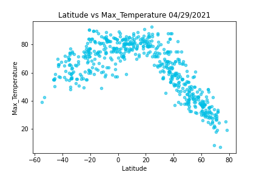
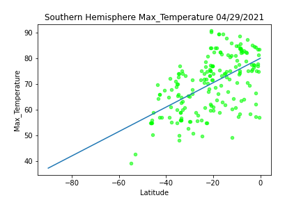
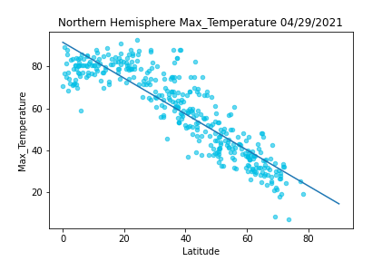
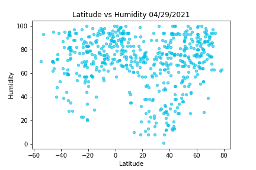
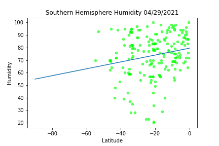
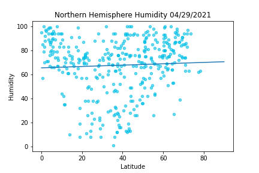
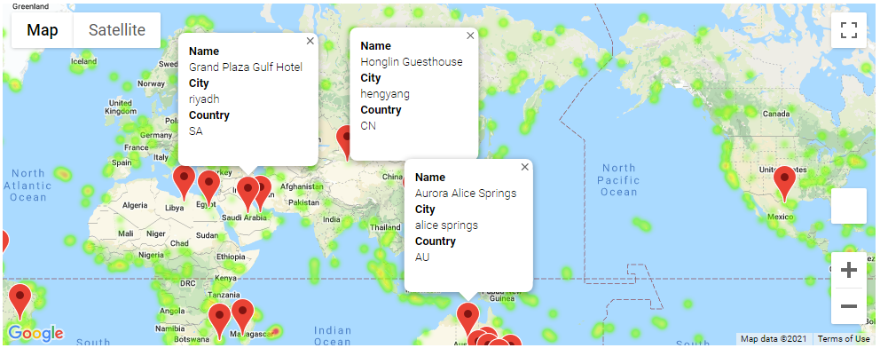

## Abstract
### Goals
Use API requests to identify the possible relationship of latitude on a city's weather. Cities are chosen at random from a random sample of lat and lng coordinates. A city's Weather data is pulled from OpenWeather. After getting weather data for our sample cities, we also want to look at the humidity for each on a gmap figure, and filter for cities with nice weather. We can then use the Google Places API to identify a hotel near the location and add that data to be visible on our gmap figure. 

## Analysis
### OpenWeather API data with Random Cities around the Globe
Of the weather metrics used in this study, Temperature is the only factor which has a correlation to latitude for a city.

</img>
</img>
</img>

Other data such as humidity yielded no correlation, however additional testing would be needed to make further claims.

</img>
</img>
</img>

### Gmap with Vacation Locations

Using weather data from OpenWeather and Google Places, we can see hotels around the world that are in locations with favorable weather.

</img>
